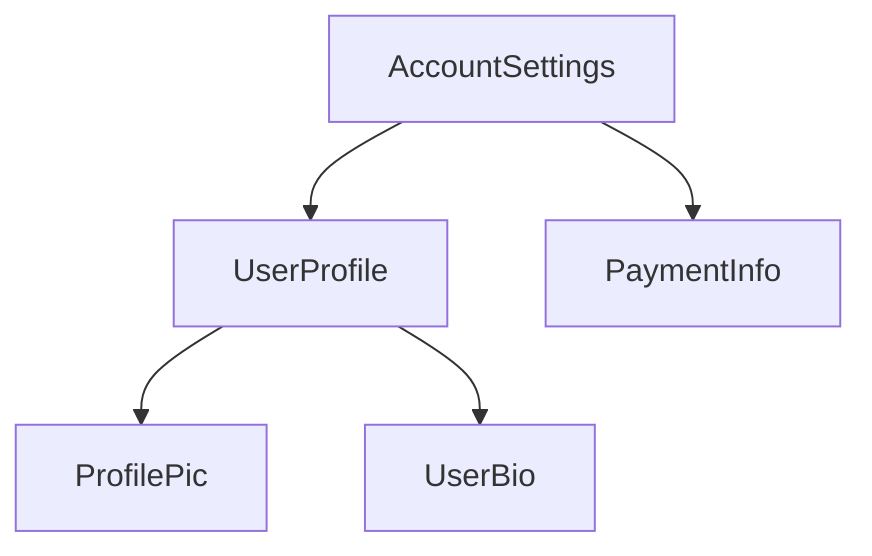

# [Components](https://angular.dev/guide/components)
every component must have:
- a TypeScript class with *behaviors* such as handling user input and fetching data from a server
- an HTML template that controls what renders into the DOM
- a [CSS selector](https://developer.mozilla.org/docs/Learn/CSS/Building_blocks/Selectors) that defines how the componet is used in HTML
you provide Angular-specific information for a component by adding a `@component` [decorator](https://www.typescriptlang.org/docs/handbook/decorators.html) on top of the Typescript class:
```ts
@Component({
    selector: 'profile-photo',
    template: ``
})
export class ProfilePhoto{}
```
for full details on writing Angular templates, including data bindinig, event handling and control flow see the [Templates guide](https://angular.dev/guide/templates).

the ojbect passed to the `@Component` decorator is called the component's **metadata**. this includes the `selector`, `template` nad other properties described throughout this guide.

\

components can optionsally include a list of CSS styles that apply to that component's DOM:
```ts
@Component({
    selector: 'profile-photo',
    template: ``,
    styles: `img { border-randius: 50%; }`
})
export class ProfilePhoto{}
```
this can help separate the concerns of *presentation* from *behavior* in your project. you can choose one approach for your entire project or you decide which to use for each component.

both `templateUrl` and `styleUrl` are relative to the directory in which the component resides.

\

\

## Using components
### imports in the `@Component` decorator
to use a component, `directive` or `pipe`. you must add it to the `imports` array in the `@Component` decorator:
```ts
import { ProfilePhoto } from './profile-photo';

@Component({
    // import the `ProfilePhoto` component in order to use it in this compoent's template.
    imports: [ProfilePhoto],
    /* ... */
})
export class UserProfile{ }
```
by defauilt, Angular components are *standlone*, meaning that you can directly add them to the `imports` array of other components. Components created with an earlier version of Angular may instead specify `standalone: false` in their `@Component` decorator. for these components, you instead import the `NgModeule` in which the component is defined. see the full [`NgModule` guide](https://angular.dev/guide/ngmodules/overview) for details.

> **IMPOERTANT:** in Angular versions before 19.0 the `standalone` option defaults to `false`.


## Showing components in a template
every component defines a [CSS selector](https://developer.mozilla.org/docs/Learn/CSS/Building_blocks/Selectors)
```ts
@Component({
    selector: 'profile-photo',
    ...
})
export class ProfilePhoto { }
```

you show a component by creating a matching HTML element in the template of *other* components:
```ts
@Component({
    selector: 'profile-photo'
})
export class ProfilePhoto{}

@Component({
    imports: [ProfilePhoto],
    template: `<profile-photo />`
})
export class UserProfile { }
```
Angular creates an instance of the component for every matching HTML element it encounters. The DOM element that matches a component's selector is referred to as that component's **host element**. The contents of a component's template are rendered inside its host element.

the DOM rendered by a component, corresponding to that component's template is called that component's **veiw**.

in composing components in this way. **you can think of your Angular applicaiton as a tree of components**.

this tree structure is important to understanding several other Angular comcepts, including [dependency injection](https://angular.dev/guide/di) and [child queries](https://angular.dev/guide/components/queries).


# [Component Selectors](https://angular.dev/guide/components/selectors)
every componet defines a [CSS selector](https://developer.mozilla.org/docs/Web/CSS/CSS_selectors) that determines how the components is used:
```ts
@Componet({ 
    selector: 'profile-photo',
    ...
})
export class ProfilePhoto { }
```
a component by creating a matching HTML element in the templates of *other* component
```ts
@Component({
    template: `
    <profile-photo />
    <button>Upload a new profile photo</button>
    `,
    ...
})
export class UserProfile { }
```
**Angular matches selectors statically at compile-time**. changeing the DOM at run-time, either via Angular binding or with DOM APIs does not affect the componets rendered.

**An element can match exactly one component select**. if multiple component selectors match a single element, Angular reports an error.

**Component selectors are case-sensitive**.

### Types of selectors
Angular supports a limited subset of [baisc CSS selector type]() in component selectors:
| Selectory type | Description | Examples |
| -------------- | ----------- | -------- |
| Type selector | matches element based on their HTML tag name or node name. | `profile-photo` |
| Attribute selector | matches elements based on the presence of an HTML attribute and optionally an exact value for that attribute. | `[dropzone]` `[type="reset"]` |
|Class selector | matches elements based on the presence of a CSS class. | `.menu-item` |

for attribute values, Angular supports matching an exact attribute value with the equals (`=`) operator.
Angular does not support other attribute value operators.

Angular component selectors do not support combinators, including the [descendant combinator](https://developer.mozilla.org/docs/Web/CSS/Descendant_combinator) or [child combinator](https://developer.mozilla.org/docs/Web/CSS/Child_combinator)

Angular component selectors do not support specifying [namespaces](https://developer.mozilla.org/docs/Web/SVG/Namespaces_Crash_Course)


### The `:not` pseudo-class
Angular support [the `:not` pseudo-class](). you can append this pseudo-class to any other selector to narrow which elements a component's selector matches. for example, you could define a `[dropzone]` attribute selector and prevent matching `textarea` elements:
```ts
@Component({
    selector: `[dropzone]:not(textarea)`,
    ...
})
export class DropZone { }
```
Angular does not support any other pseudo-classes or pseudo-elements in component selectors.


### Combining selectors
you can combine multiple selectors by concatenating them. for example, you can match `<button>` elements that specify `type="reset"`:
```ts
@Component({
    selector: 'button[type="reset"]',
    ...
})
export class ResetButton { }
```
Angular creates a component for each element that matches *any* of the selectors in the list.


### Choosing a selector
the vast marjority of components should use a custom element name as their selector. All custom element names should include a hyphen as described by [the HTML specification](). by default, Angular reports an error if it encounters a custom tag name that does not match any available components, preventing bugs due to mistyped component names.

see [Advanced component configuration](https://angular.dev/guide/components/advanced-configuration) for details on using [native custom elements](https://developer.mozilla.org/en-US/docs/Web/API/Web_components) in Angular templates.


### Selector prefixes
the Anuglar team recoments using a short, consistent prefix for all the custom components defined inside your project. for example, if you were to build YouTube with Angular, you might prefix your components with `yt-`, with components like `yt-menu`,`yt-player` etc. Namespacing your selectors like this makes it immediately clear where a particular component comes from. by defalt, the Angular CLI uses `app-`.

Angular uses th `ng` selector prefix for its own framework APIs. Never use `ng` as a selector prefix for your own custom components.

### When to use an attribute selector
you should consider an attribute selector when you want to create a component on a standard native element. from example, if you want to create a custom button component, you can take advantage of the standard `<button>` element by using an attribute selector:
```ts
@Component({
    selector: 'button[yt-upload]',
    ...
})
export class YouTubeUploadButton { }
```
this approach allow comsumers of the component to directly use all the element's standard APIs without extra work. This is expecially valuable for ARIA attributes such as `aria-label`.

Angular does not report error when it encounters custom attributes that don't match an available component. when using components with attribute selector, consumers may forget to import the component or its NgModule, resulting in the component not rendering. see [importing and using components](https://angular.dev/guide/components/importing) for more information.

Components that define attribute selector should use lowercase, dash-case attributes. you can follow the same prefixing recommendation described above.


# [Styleing](https://angular.dev/guide/components/styling)


[Material](https://material.angular.io/components/categories)

[Primeng](https://primeng.org/autocomplete)
