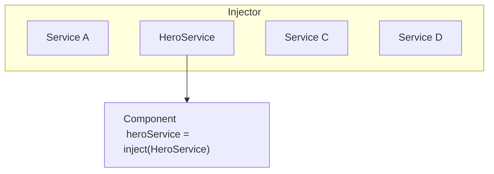
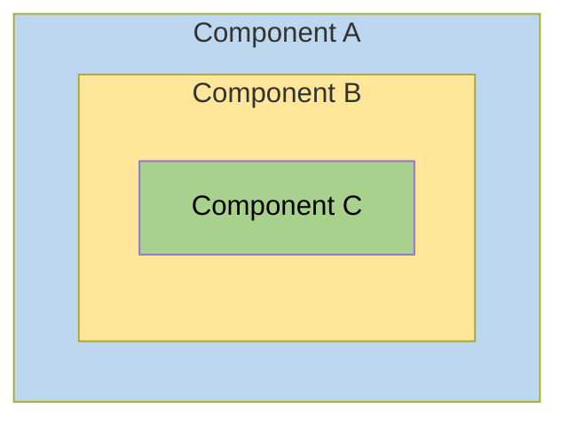
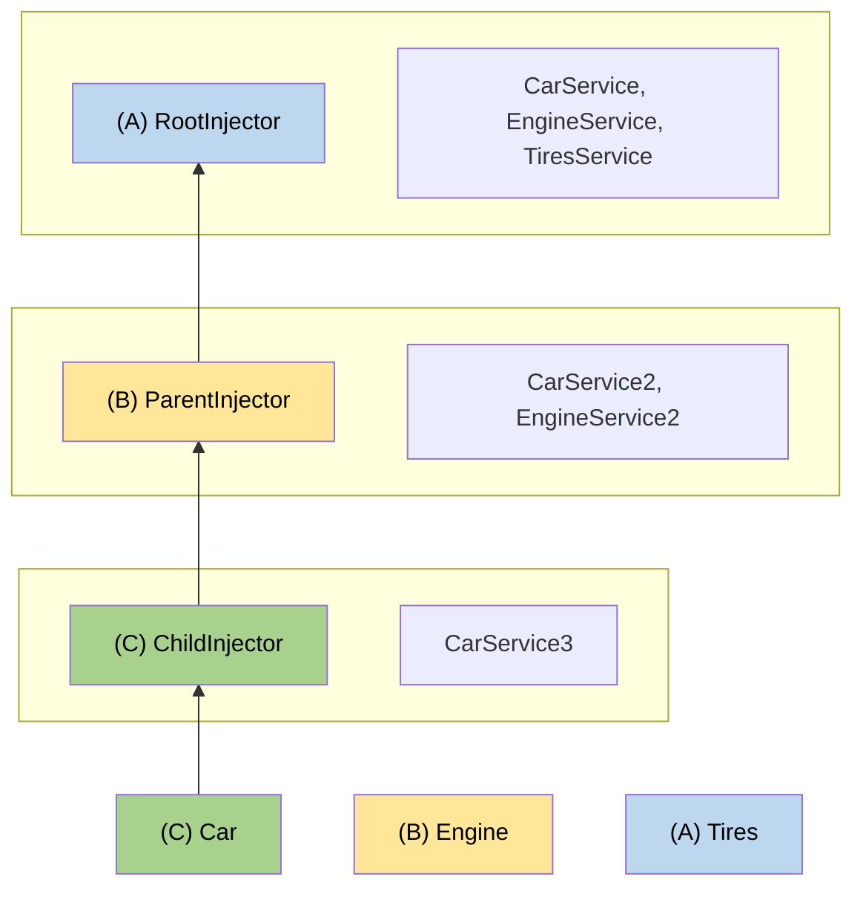

# [Dependency Injection in Angular](https://angular.dev/guide/di)
> "DI" is a design pattern and mechanism for creating and delivering some parts of an app the other parts of an app that require them.

when  you develop a smaller part of your system, like a module or a class, you may need to use features from other classes. For example, you may need an HTTP service to make backend calls. Dependency Injection or DI is a design pattern and mechainsm for creating and delivering some parts of an application to other parts of an application that require them. Angular supports this design pattern and you can use it in your applications to increase flexibility and modularity.

in Angular, dependencies are typically services but they also can be values such as strings or functions. an injector for an application (created automatically during bootstrap) instantiates dependencies when needed using a configured provider of the service or value.

## [understanding dependency injection](https://angular.dev/guide/di/dependency-injection)
dependency injection or DI is one of the cundamental concepts in Angular. DI is wired into the Angular framework and allows classes with Angular decorators such as Components, Directives, Pipes and Injectables to configure dependencies that they need.

two main roles exist in the DI system: dependency consumer and dependency provider.

Angular facilitates the interaction between dependency consumers and dependency providers using an abstraction called `Injector`. when a dependency is requested, the injector checks its registry to see if there is an instance already available there. if not a new instance is created and stored in the registry. Angular creates an application-wide injector (also known as the "root" injector) during the application bootstrap process. in most cases you don't need to manually create injectors, but you should know that there is a layer that connects providers and consumers.

this topic covers basic scenarios of how a class can act as a dependency. Angular also allows you to use functions, objects, primitive types such as string or Boolean or any other types as dependencies. for more information, see [Dependency providers](https://angular.dev/guide/di/dependency-injection-providers).


## [Providing a dependency]
consider a class called `HeroService` that needs to act as a dependency in a component.

the first step is to add the `@Injectable` decorator to show that the class can be injected.

```ts
@Injectable()

class HeroService {}
```

the next step is to make it available in the DI by providing it. a dependency can be provided in multiple places:
- [Preferred: at the application root level using `providedIn`](https://angular.dev/guide/di/dependency-injection#preferred-at-the-application-root-level-using-providedin)
- [At the Component level](https://angular.dev/guide/di/dependency-injection#at-the-component-level)
- [At the application root level using `ApplicationConfig`](https://angular.dev/guide/di/dependency-injection#at-the-application-root-level-using-applicationconfig)
- [`NgModule` based applications](https://angular.dev/guide/di/dependency-injection#ngmodule-based-applications)


### [Preferred: At the application root level using `providedIn`](https://angular.dev/guide/di/dependency-injection#preferred-at-the-application-root-level-using-providedin)
providing a service at the application root level using `providedIn` allow injecting the service into all other classes. Using `providedIn` enables Angular and JavaScript code optimizers to effectively remove servicees that are unused (known as tree-shaking).

you can provide a services by using `providedIn: 'root'` in the `@Injectable` decorator:
```ts
@Injectable({
    providedIn: 'root'
})
class HeroService {}
```

when you provide the service at the root level Anuglar creates a single, shared instance of th `HeroService` and injects it into any class that asks for it.


### at the Component level
you can provide services at `@Component` level by suing the `providers` field of the `@compoent` decorator. in this case the `HeroService` becomes available to all instances of this component and other components and directives used in the template.

for example:
```ts
@Component({
    selector: 'hero-list',
    template: '...',
    providers: [ HeroService ]
})
class HeroListComponent {}
```
when you register a provider at the component level, you get a new instance of the service with each new instance of that component.

> **NOTE**: Declaring a service like this causes `HeroService` to always be included in your application -- even if the service is unused.


### [at the application root level using `ApplicationConfig`](https://angular.dev/guide/di/dependency-injection#at-the-application-root-level-using-applicationconfig)
you can use the `providers` field of the `ApplicationConfig` (passed to the `bootstrapApplication` function) to provide a service or other `Injectable` at the application level.

in the example below, the `HeroService` is available to all components, directives and pipes:
```ts
export const appConfig: ApplicationConfig = {
    providers: [
        { provider: HeroService }
    ]
};
```

then, in `main.ts`:

```ts
bootstrapApplication(AppComponent, appConfig)
```

> NOTE: Declaring a service like this causes `HeroService` to always be included in your application -- even if the service is unused.


### `NgModule` based applications
`@NgModule` - based applications use the `providers` field of the `@NgModule` decorator to provide a service or other `Injectable` available at the application level.

a service provided in a module is available to all declarations of the module or to any other modules which share the same `ModuleInjector`. to understand all edge-cases, see [Hierachical injectors](https://angular.dev/guide/di/hierarchical-dependency-injection).

> NOTE: Declaring a service using `providers` causes the service to be included in your application -- even if the service is unused.

### Injecting/consuming a dependency
use Angular's `inject` function to retrieve dependencies.
```ts
import { Component, inject } from 'angular/core';

@Component({ /* ... */ })
export class UserProfile {
    // you can use the `inject` function in property initializers.
    private userClient = inject(UserClent);

    constructor() {
        //you can also use the `inject` function in a constructor.
        const logger = inject(Logger);
    }
}
```
you can use the `inject` function in any [injection context](https://angular.dev/guide/di/dependency-injection-context). 
most of the time, this is in a class property initializer or a class constructor for components, directives, serivces and pipes.

when Angular discovers that a component depends on a service, it first checks if the injector has any existing instances of that service. if a requested service instance doesn't yet exist, the injector creates one using the registered provider and adds it to the injector before returning the service to Angular.

when all requested services have been resolved and returned, Angular can call the component's contructor with those services as arguments.




## [Creating an injectable service](https://angular.dev/guide/di/creating-injectable-service)
Service is a broad category encompassing any value, function or feature that an application needs. a service is typically a class with a narrow, well-defined purpose. a component is noe type of class that can use DI.

Angular distinguishes components from services to increase modularity and reusability. by separating a component's view-related features from other kinds of processing you can make your component classes lean and efficient.

Ideally, a component's job is to enable the user experience and nothing more. A component should present properties and methods for data binding to mediate between the view (rendered by the template) and the application logic (which often includes some notion of a model).

a components can delegate certain tasks to services such as fetching data from the server validating ussser input or logging directly to the console. by defining such processing tasks in an injectable service class, you make those tasks available to any component. you can also make your application more adaptable by configuring defferent providers of the same kind of service as appropriate in different circumstances.

Angular does not enforce these principles. Angular helps you follow these principles by making it easy to factor your application logic into services and make those services available to components through DI.

### Service examples
here's an example of a service class that logs to the browser console:
```ts
export class Logger {
    log(msg: unknow) { console.log(msg); }
    error(msg: unknow) { console.error(msg); }
    warn(msg: unknow) { console.warn(msg); }
}
```

services can depend on other services. for example, here's a `HeroService` that depends on the `Logger` service, and also uses `BackendService` to get heroes. That service in turn might depend on the `HttpClient` service to fetch heros asynchronously from a server:
```ts
import { inject } from "@angular/core";

export class HeroService {
    private heroes: Hero[] = [];

    private backed = inject(BankendService);
    private logger = inject(Logger);

    async getHeroes(){
        // fetch
        this.heroes = await this.backend.getAll(Hero);
        // log
        this.logger.log(`Fetched ${this.heroes.length} heroes.`);

        return this.heroes;
    }
}
```


### Creating an injectable service
the Angular CLI provides a command to create a new service. in the following example, you add a new service to an existing application.

to generate a new `HeroService` class in th `src/app/heroes` folder, follow these steps:
1. run this [Angular CLI]() command:
```cmd
ng generate service heroes/hero
```

this command creates the following default `HeroService`:
```ts
import { Injectable } from '@angular/core';

@Injectable({
    providedIn: 'root'
})
export class HeroService {}
```

the `@Injectable()` decorator specifies that Angular can use this class in the DI system. The metadata, `providedIn: 'root'`, means that the `HeroService` is provided throughout the application.

Add a `getHeroes()` method that returns the heroes from `mock.heroes.ts` to get the hero mock data:

```ts
import { Injectable } from '@angular/core';
import { HEROES } from './mock-heroes';

@Injectable({
    // declares that this service should be created by the root application injector.
    providedIn: 'root'
})
export class HeroService {
    getHeroes() {
        return HEROES;
    }
}
```
for clarity and maintainability, it is recommended that you define components and services in separate files.


### Injecting services
to inject a service as a dependency into a component, you can declare a class field representing the dependency and use Angular's `inject` function to initialize it.

the following example specifies the `HeroService` in the `HeroListComponent`. the type of `heroService` is `HeroService`.
```ts
import { inject } from "@angular/core";

export class HeroListComponent {
    private heroService = inject(HeroService);
}

it is also possible to inject a service into a component using the component's constructor:
```ts
constructor(private heroService: HeroService)
```

the `inject` method can be used in both classes and functions, while the constructor method can naturally only be used in a class constructor. However, in either case a dependency may only be injected in a valid [injection context](https://angular.dev/guide/di/dependency-injection-context), usualy in the construction or initialization of a component.


### Injecting services in other services
when a service depends on another service, follow the same pattern as injecting into a component. in the following example, `HeroService` depends on a `Logger` service to report its activities:
```ts
import { inject, Injectable } from '@angular/core';
import { HEROES } from './mock-heroes';
import { Logger } from './logger.service';

@Injectable({
    providedIn: 'root'
})
export class HeroService {
    private logger = inject(Logger);

    getHeroes(){
        this.logger.log("Getting heroes.");
        return HEROES;
    }
}
```


## [Configuring dependency providers](https://angular.dev/guide/di/dependency-injection-providers)
the previous sections described how to use class instances as dependencies. Aside from classes, you can also use values such as `boolean`, `string`, `Date` and objects as dependencies. Angular provides the nessessary APIs to make the dependency configuration flexible, so you can make those values available in DI.

### Specifying a provider token
if you specify the service class as the provider token, the default behavior is for the injector to instantiate that class using th `new` operator.

in the following example, the app component provides a `Logger` instance:
```ts // app.component.ts
... 
providers: [ Logger ],
...
```
you can, however, configure DI to associate the `Logger` provider token with a different class or any other value. so when the `Logger` is injected, the configured value is used instead.

in fact, the class provider syntax is a shorthand expression that expands into a provider configuration, defined by the `Provider` interface. Angular expands the `providers` value in this case into a full provider object as follows:
```ts // app.conponents.ts
[{ provide: Logger, useClass: Logger }]
```
the expanded provider configuration is an object literal with two properties:
- the `provide` property holds the token that serves as the key for consuming the dependedcy value.
- the second property is a provider definition object, which tells the injector **how** to create the dependency value. the provider-definition can be one of the following:
    - `useClass` - this option tells Angular DI to instantiate a provided class when a dependency is injected.
    - `useExisting` - allows you to alias a token and reference any existing one.
    - `useFactory` - allow you to define a function that constructs a dependency.
    - `useValue` - provides a static value that should be used as a dependency.
the sections below describe how to use the different provider definitions.


### Class providers: useClass
the `useClass` provider key lets you create and return a new instance of the specified class.

you can use the type of provider to substitute an alternative implementation for a common or default calss.
the alternative implementation can for example, implement a different strategy extend the default class or emulate the behavior of the real class in a test case.

in the following example, `BetterLogger` would be instantiated when the `Logger` dependency is requested in a component or any other class:
```ts 
// /src/app/app.componet.ts
[{ provide: Logger, useClass: BatterLogger }]
```
if the alternative class providers have their own dependencies, specify both providers in the providers
metadata property of the parent module or component:
```ts
// src/app/app.component.ts
[
    UserService, // dependency needed in `EvenBetterLogger`.
    { provider: Logger, useClass: EvenBetterLogger }
]
```
in this example, `EvenBetterLogger` displays the user name in the log message. this logger gets the user from an injected `UserService` instance:
```ts
// src/app/even-better-logger.component.ts
@Injectable()
export class EvenBetterLogger extends Logger {
    private userService = inject(UserService);

    override log(message: string){
        const name = this.userService.user.name;
        super.log(`Message to ${name}: ${message}`);
    }
}
```
Angular DI knows how to construct the `UserService` dependency, since it has been configured above and is available in the injector.


### Alias providers: useExisting
the `useExisting` provider key lets you map one token to another. in effect, the first token is an alias for the service associated with the second token, createing tow ways to access the same service object.

in the following example, the injector injects the singleton instance of `NewLogger` when the component asks for either the new or the old logger: in this way, `OldLogger` is an alias for `NewLogger`.
```ts
/// src/app/app.component.ts
[
    NewLogger, // alias OlderLogger w/ reference to NewLogger
    { provide: OldLogger, useExisting: NewLogger }
]
```
> NOTE: ensure you do not alias `OldLogger` to `NewLogger` with `useClass`, as this creates two different `NewLogger` instances.


### Factory providers: useFactory
the `useFactory` provider key lets you create a dependency object by calling a factory function. With this approach, you can create a dynamic value based on information available in the DI and elsewhere in the app.

in the following example, only authorized user should see secret heroes in the `HeroService`.
Authorization can change during the course of a signle application session, as when a diferrent user logs in.

to keep security-sensitive information in `UserService` and out of `HeroService`, give the `HeroService` constructor a boolean flag to control display of secret heroes:
```ts
// src/app/heroes/hero.service.ts
class HeroService {
    constructor(private logger: Logger, private isAuthorized: boolean) {}
    
    getHeroes() {
        const auth = this.isAuthorized ? 'authorized' : 'unauthorized';
        this.logger.log(`Getting heroes for ${auth} user.`);
        return HEROES.filter(hero => this.isAuthorized || !hero.isSecret);
    }
}
```

to implement the `isAuthorized` flag, use a factory provider to create a new logger instance for `HeroService`. this is necessary as we need to manually pass `Logger` when constructing the hero service:
```ts
// src/app/heroes/hero.service.provider.ts
const heroServiceFactory = (logger: Logger, userService: UserService) => new HeroService(logger, userService.user.isAuthorized);
```

the factory function has access to `UserService`. you inject both `Logger` and `UserService` into the factory provider so the injector can pass them along to the factory function:
```ts
/// src/app/heroes/hero.service.provider.ts
export const heroServiceProvider = {
    provide: HeroService,
    userFactory: heroServiceFactory,
    deps: [Logger, UserService]
};
```

- the `useFactory` field specifies that the provider is a factory function whose implementation is `heroServiceFactory`.
- the `deps` property is an array of provider tokens, the `Logger` and `UserService` classes serve as tokens for their own class providers. the injector resolves these tokens and injects the corresponding services into the matching `heroServiceFactory` factory function parameters, bases on the order specified.

capturing the factory provider in the exported variable, `heroServiceProvider`, makes the factory provider reusable.


### Value providers: useValue
the `useValue` key lets you associate a static value with a DI token.

use this technique to provide runtime configuration constants such as website base addresses and feature flags. you can also use a value provider in a unit test to provide mock data in place of a production sata service.

the new section provides more information about the `useValue` key.


### using an `InjectionToken` object
use an `InjectionToken` object as provider token for non-class dependencies. the following example defines a token, `APP_CONFIG` of the type `InjectionToken`:
```ts
// src/app/app.config.ts
import { InjectionToken } from '@angular/core';

export interface AppConfig {
    title: string;
}

export const APP_CONFIG = new InjectionToken<AppConfig>('app.config description');
```
the optional type parameter, `<AppConfig>`, and the token description, `app.config description`, specify the token's purpose.

next, register the dependency provider in the componet using the `InjectionToken` object of `APP_CONFIG`:
```ts
// src/app/app.componsnt.ts
const MY_APP_CONFIG_VARIABLE: AppConfig ={
    title: 'Hello'
};

provider: [{ provide: APP_CONFIG, useValue: MY_APP_CONFIG_VARIABLE}]
```

new, inject the configuration object in the constructor body with the `inject` function:
```ts
// src/app/app.components.ts
export class AppComponent {
    constructor() {
        const config = inject(APP_CONFIG);
        this.title = config.title;
    }
}
```

### Interfaces and DI
though the TypeScript `AppConfig` interface supports typing within the class, the `AppConfig` interface plays no role in DI. in TypeScript, an interface is a design-time artifact, and does not have a runtime repersentation or token that the DI framework can use.

when the TypeScript transpiles to JavaScript, the interface desppears because JavaScript doesn't have interfaces. because there is no interface for Angular to find at runtime, the interface cannot be a token, nor can you inject it:
```ts
// src/app/app.component.ts
// can't use interface as  provider token
[{ provide: AppConfig, useValue: MY_APP_CONFIG_VARIABLE }]

...
export class AppComponent {
    // can't inject using the interface as the parameter type
    private config = inject(AppConfig);
}

```


## [Injectiong context](https://angular.dev/guide/di/dependency-injection-context)
the dependency injection (DI) system relies internally on a runtime context where the current injection is available. this means that injectors can only work when code is executed in such a context.

the injection context is a available in these situations:
- during construction (via the `constructor`) of a class being instantiated by the DI system, such as an `@Injectable` or `@Component`.
- in the initializer for fields of such classes.
- in the factory function specified for `useFactory` of a `Provider` or an `@Injectable`.
- in the `factory` function specified for an `InjectionToken`.
- Within a stack frame that runs in an injection context.

knowing when you are in an injection context will allow you to use the `inject` function to inject instances.

### Class constructors
every time the DI system instantiates a class, it does so in an injection context. this is handled by the framework itself. the constructor of the class is executed in that runtime context, which also allows injection of a token using the `inject` function.

```ts
class MyComponent {
    private service1: Service1;
    private service2: Service2 = inject(Service2); // in context

    constructor() {
        this.service1 = inject(Service1) // in context
    }
}
```

### Stack frame in context
some APIs are designed to be run in an injection context. this is the case, for example, with router guards. this allows the use of `inject` within the guard function to access a service.

here is a example for `CanActivateFn`

```ts
const canActivateTeam: CanActivateFn =
    (route: ActivatedRouteSnapshot, state: RouterStateSnapshot) => {
        return inject(PermissionsService).canActivate(inject(UserToken), route.params.id);
    }
```

### Run within an injection context
when you want to run a given function in an injection context without already being in one, you can do so with `runInInjectionContext`. this requires access to a given injector, like the `EnvironmentInjector`, for ecample:
```ts
// src/app/heroes/hero.service.ts
@Injectable({
    providedIn: 'root',
})
export class HeroService {
    private environmentInjector = inject(EnvironmentInjector);

    someMethod() {
        runInInjectionContext(this.environmentInjector, () => {
            inject(SomeService); // do what you need with the injeced service
        });
    }
}
```
note that `inject` will return an instance only if the injector can resolve the required token.


### Asserts the context
Angular provides the `assertInInjectionContext` helper function to assert that the current context is an injection context.

### Using DI outside of a context
calling`inject` or calling `assertInInjectionContext` outside of an injection context will throw [error](https://angular.dev/errors/NG0203)


## [Hierarchical injectors]
injectors in Angular have rules that you can leverage to achieve the desired visibility of injectables in your applications. By understanding these rules, you can determine whether to declare a provider at the application level, in a Component or in a Directive.

the applications you build with Angular can become quite large, and one way to manage this complexity is to split up the application into a well-defined tree of components.

there can be sections of your page that work in a completely independent way than the rest of the application, with its own local copies of the services and other dependencies that it needs. some of the services that these sections of the application use might be shared with other parts of the application, or with parent components that are further up in the component tree, while other dependencies are meant to be private.

with hierarchical dependency injection, you can isolate sections of the application and give them their own private dependencies not shared with the rest of the application or have parent components share certain dependencies with its child components only but not with the rest of the component tree and so on. Hierarchical dependency injection enables you to share dependencies between different parts of the application only when and if you need to.


### Types of injector hierarchies
Angular has two injector hierarchies:

| Injector heirarchies | Details |
| -------------------- | ------- |
| `EnvironmentInjector` hierarchy | configure an `EnvironmentInjector` in this hierarchy using `@Injectable()` or `providers` array in `ApplicationConfig`. |
| `ElementInjector` hierarchy | created implicitly at each DOM element. an `ElementInjector` is empty by default unless you configure it in the `providers` property on `@Directive()` or `@Component()`. |


-----
`NgModule Based Application`
for `NgModule` based application, you can provide dependencies with the `ModuleInjector` hierarchy using an `@NgModule()` or `@Injectable()` annotation.
-----

### `EnvironmentInjector`
the `EnvironmentInjector` can be configured in one of two ways by using:
- the `@Injectable()` `providedIn` property to refer to `root` or `platform`
- the `ApplicationConfig` `providers` array
-----

`Tree-shaking and @Injectable()`
using the `@Injectable()` `providedIn` property is preferable to using the `ApplicationConfig` `providers` array. with `@Injectable()` `providedIn`, optimization tools can perform tree-shaking, which removes services that your application isn't using. this results in smaller bundle sizes.

tree-shaking is especially useful for a library because the application which uses the library may not have a need to inject it.
-----

`EnvironmentInjector` is configured by the `ApplicationConfig.providers`.

provide services using `providedIn` of `@Injectable()` as follows:
```ts
import { Injectable } from '@angular/core';

@Injectable({
    providedIn: 'root' // <-- provider this service in the root EnvironmentInjector
})
export class ItemService{
    name = 'telephone';
}
```
the `@Injectable()` decorator identifies a service class. the `providedIn` property configures a specific `EnvironmentInjector`, here `root`, which makes the service available in the `root` `EnvironmentInjector`.


### ModuleInjector
in the case of `NgModule` based application, the ModuleInjector can be configured in one of two ways by using:
- the `@Injectable()` `providedIn` property to refer to `root` or `platform`
- the `@NgModule()` `providers` array

`ModlueInjector` is configured by the `@NgModule.providers` and `NgModule.imports` property.
`ModuleInjector` is a flattening of all the providers arrays that can be reached by following the `NgModule.imports` recursively.

child `ModuleInjector` hierarchies are created when lazy loading other `@NgModules`.


### Platform injecotor
there are two more injectors above `root`, an additional `EnvironmentInjector` and `NullInjector()`.

consider how Angular bootstraps the application with the following in `main.ts`:

```ts
bootstrapApplication(AppComponent, appConfig);
```
the `bootstrapApplication()` method creates a child injector of the platform injector which is configured by the `ApplicationConfig` instance. this is the `root` `EnvironmentInjector`.

the `platformBrowserDynamic()` method creates an injector configured by a `PlatformModule`, which contains platform-specific dependencies. the allows multiple applications to share a platform configuration.
for example, a browser has only one URL bar, no matter how many applications you have running. you can configure additional platform-specific providers at the platform level by supplying `extraProviders` using the `platformBrowser()` function.

the next parent injector in the hierarchy is the `NullInjector()`, which is the top of the tree. if you've gone so far up the tree that you are looking for a service in the `NullInjector()`, you'll get an error unless you've used `@Optional()` because ultimately, everything ends at the `NullInjector()` and it returns an error or, in the case of `@Optional`, `null`. for more information on `@Optional()`, see the [`@Optional()` section](https://angular.dev/guide/di/hierarchical-dependency-injection#optional) .

the following diagram represents the relationship between the `root` `ModuleInjector` and its parent injectors as the previous paragraphs describe.

-->

while the name `root` is a special alias, other `EnvironmentInjector` hierarchies don't have aliases. you have the option to create `EnvironmentInjector` hierarchies whenever a dynamically loaded component is created, such as with the Router, which will create child `EnvironmentInjector` hierarchies.

all requests forward up to the root injector, whether you configured it with the `ApplicationConfig` instance passed to the `bootstrapApplication()` method or registered all providers with `root` in their own services.

-----

### [`@Injectable()` vs `ApplicationConfig`]()
if you configure an app-wide provider in the `ApplicationConfig` of `bootstrapApplication`, it overrides one configured for `root` in the `@Injectable()` metadata. you can do this to configure a non-default provider of a service that is shared with multiple application.

here is an example of the case where the component router configuration includes a non-default [location strategy](https://angular.dev/guide/routing#location-strategy) by listing its provider in the `providers` list of the `ApplicationConfig`.
```ts
provider: [
    { provide: LocationStrategy, useCladd: HashLocationStrategy }
]
```
for `NgModule` based applications, configure app-wide providers in the `AppModule` `providers`.


### `ElementInjector`
Angular create `ElementInjector` hierarchies implicitly for each DOM element.

providing a service in the `@Component()` decorator using its `providers` or `viewProviders` property configures an `ElementInjector`. for example, teh following `TestComponent` configures the `ElementInjecotr` by providing the service as follows:

```ts
@Componet({
    ...
    providers: [{ provide: ItemService, useValue: { name: 'lamp' }}]
})
export class TestComponet
```

> HELPFUL: see the [resolution rules](https://angular.dev/guide/di/hierarchical-dependency-injection#resolution-rules) section to understand the relationship between the `EnvironmentInjector` tree, the `ModuleInjector` and the `ElementInjector` tree.

when you provide services in a component, that service is available by way of the `ElementInjector` at that comonent instance. it may alsow be visible at child component/directives based on visibility rules described in the [resolution rules](https://angular.dev/guide/di/hierarchical-dependency-injection#resolution-rules) section.

when the component instance is destroyed, so is that service instance.


### `@Directive()` and `@Component()`
a component is a special type of directive, which means that just as `@Directive()` has a `providers` property, `@Component()` does too. this means that directives as well as components can configure providers, using the `providers` property. when you configure a provider for a component or directive using the `providers` property, that provider belongs to the `ElementInjector` of that component or directive. Components and directives on the same element share an injector.


### Resolution rules
when resolving a token for a component/directive, Angular resolves it in two phases:
1. against its parents in the `ElementInjector` hierarchy.
2. against its parents in the `EnvironmentInjector` hierarchy.

when a component declares a dependency, Angular tries to satisfy that dependency with its own `ElementInjector`. If the component's injector lacks the provider, it passes the request up to its parent component's `ElementInjector`.

the requests keep forwarding up until Angular finds an injector that can handle the request or runs out of ancestor `ElementInjector` hierarchies.

if Angular doesn't find the provider in any `ElementInjector` hierarchies, it goes back to the element where the request originated and looks in the `EnvironmentInjector` hierarchy. if Angular still doesn't find the provider, it throws an error.

if you have registered a provider for the same DI token at different levels, the first one Angular encounters is the one it uses to resolve the dependency. if, for example, a provider is registered locally in the component that needs a service, Angular doesn't look for another provider of the same dervice.

> HELPFULL: for `NgModule` based applications Angular will search the `ModuleInjector` hierarchy if it cannot find a provider in the `ElementInjector` hieararchies.


### REsolution modifiers
Angualar's resolution behavior can be modified with `optional`, `self`, `skipSelf` and `host`.
import each of them from `@angular/core` and use each in the `inject` configuration when you inject your service.

#### Types of mofifiers
resolution modifiers fall into three categories:
- what to do if Angular doesn't find what you're looking for, that is `optional`
- where to start looking, that is `skipSelf`
- where to stop looking, `host` and `seft`
by default, Angular always starts at the current `Injector` and keeps searching all the way up. Modifiers allow you to change the starting or ***self***, location and the ending location.

additionally, you can combine all of the modifiers except:
- `host` and `self`
- `skipSelf` and `self`

#### [`optional`](#optional)
`optional` allows Angular to consider a service you inject to be optional. this way, if it can't be resolved at runtime, Angular resolves the service as `null`, rather than throwing an error. in the following example, the service, `OptionsalService`, isn't provided in the service, `ApplicationConfig`, `@NgModule()` or components class so it isn't available anywhere in the app.
```ts
#src/app/optional/optional.component.ts
export class OptionalComponent {
    public optional? = inject(OptionalService, { optional: true });
}
```


### [`self`](#self)
use `self` so that Angular will only look at the `ElementInjector` for the current component or directive.

a good use case for `self` is to inject a service but only if it is available on the current host element. to avoid errors in the situation, combine `self` with `optional`.

for example, in the following `SelfNoDataComponent`, notice the injected `LeafService` as a property.
```ts
# src/app/self-no-data/self-no-data.component.ts
@Component({
    selector: 'app-self-no-data',
    templateUrl: './self-no-data.component.html',
    styleUrls: ['./self-no-data.component.css']
})
export class SelfNoDataComponent {
    public leaf = inject(LeafService, { optional: true, self: true });
}
```
in this example, there is a parent provider and injecting the service will return the value,  however, injecting the service with `self` and `optional` will return `null` because `self` tells the injector to stop searching in the current host element.

another example shows the component class with a provider for `FlowerService`. in this case, the injector looks no further than the current `ElementInjector` because in finds the `FlowerService` and returns the tulip.
```ts
# src/app/self/self.component.ts
@Component({
    selector: 'app-self',
    templateUrl: './self.component.html',
    styleUrls: ['./self.component.css'],
    providers: [{ provide: FlowerService, useValue: { emoji 'x'}}]
})
export class SelfComponent {
    constructor(@Self() public flower: FlowerService) {}
}
```

### [`skipSelf`](#skipSelf)
`skipSelf` is the opposite of `self`. with `skipSelf`, Angular starts its search for a service in the parent `ElementInjector`, rather than in the current one. so if the parent `ElementInjector` were using the fern 'x' value for `emoji`, but you had maple leaf 'y' in the component's `providers` array, Angular would ignore maple leaf 'y' and use fern 'x'.

to see this in code, assume that the following value for `emoji` is what the parent component were using, as in this service:
```ts src/app/leaf.service.ts
export class LeafSesrvice {
    emoji = 'x';
}
```
imagine that in the child component, you had a different value, maple leaf 'y' but you wanted to use the parent's value instead. this is when you'd use `skipSelf`:
```ts src/app/skipself/skipself.component.ts
@Component({
    selector: 'app-skipself'
    ...
    // angular would ignore this LeafService instance
    providers: [{ provide: LeafService, useValue: { emoji: 'y' }}]
})
export class SkipselfComponent {
    // use skipSelf as inject option
    public leaf = iject(LeafService. {skipSelf:true});
}
```
in this case, the value you'd get for `emoji` would be fern 'x', not maple leaf 'y'.


### `skipSelf` option with `optional`
use the `skipSelf` option with `optional` to prevent an error if the value is `null`.

in the following example, the `Person` service is injected during property initialization. `skipSelf` tells Angular to skip the current injector and `optional` will prevent an error should the `Person` service be `null`.
```ts
class Person {
    parent = inject(Person, {optional:true, skipSelf:true })
}
```

### [`host`](#host)
`host` lets you designate a component as the last stop in the injector tree when searching for providers.

event if there is a service instance further up the tree, Angular won't continue looking. Use `host` as follows:
```ts 
#src/app/host/host.component.ts
@Component({
    selector: 'app-host',
     ...
    // provide the service 
    providers: [{ provide: FlowerService, useValue: { emoji: 'x' }}]
})
export class HostComponent {
    // use host when injecting the service
    flower = inject(FlowerService, { host:true, optional:true });
}
```
since `HostComponent` has the `host` option, on matter what the parent of `HostComponent` might have as a `flower.emoji` value, the `HostComponent` will use tulip 'x'.


### Modifiers with constructor injection
similarly as presented before, the behavior of constructor injection can be modified with `@Optional()`, `@Self()`, `@SkipSelf()` and `@Host()`.

import each of them from `@angular/core` and use each in the component class constructor when you inject your service.
```ts 
# src/app/self-on-data/self-no-data.component.ts
export class SelfNoDataComponent {
    constructor(@Self() @Optional() public leaf?: LeafService) {}
}
```


## Logical structure of the template
when you provide services in the component class, services are visible within the `ElementInjector` tree relative to where and how you provide those services.

understanding the underlying logical structure of the Angular template will give you a foundation for configuring services and in turn control their visibility.

components are used in your templates, as in the following example:
```html
<app-root>
    <app-child></app-child>
</app-root>
```

> HELPFUL: usually, you declare the components and their templates in separate files. for the purposes of understanding how the injection system works, it is useful to look at them from the point of view of a combined logical tree. the tern logical distinguishes it from the render tree, which is your application's DOM tree. to mark the locations of where the component templates are located, this guide uses the `<#VIEW>` pseudo-element, which doesn't actually exist in the render tree and is present for mental model purposes only.

the following is an example of how the `<app-root>` and `<app-child>` view trees are combined into a single logical tree:
```html
<app-root>
    <#VIEW>
        <app-child>
            <#VIEW>
                ...content goes here...
            </#VIEW>
        </app-child>
    </#VIEW>
</app-root>
```
understanding the idea of the `<#VIEW>` demarcation is especially significant when you configure services in the component class.


### example: Providing services in `@Component()`
how you provide services using a `@Component()` or `@Directive()` decorator determines their visibility. the following sections demonstrate `providers` and `viewProviders` along with ways to modify service visibility with `skipSelf` and `host`.

a component class can provide services in two ways:
| Arrays | Details |
| ------ | ------- |
| with a `providers` array | `@Component({ providers: [SomeService] })` |
| with a `viewProviders` array | `@Component({ viewProviders: [SomeService ]})` |
in the example below, you will see the logical tree of an Angular application. to illustrate how the injector works in the context of templates, the logical tree will represent the HTML structure of the application. for example, the logical tree will show that `<child-component>` is a direct children of `<parent-component>`.

in the logical tree, you will see special attributes: `@Provide`, `@Inject` and `@ApplicationConfig`.
these aren't real attributes but are here to demonstrate what is going on under the hood.

| Angular service attribute | Details |
| ------------------------- | ------- |
| `@Inject(Token)=>Value` | if `Token` is injected at this location in the logical tree, its value would be `Value`. |
| `@Provide(Token=Value)` | indicates that `Token` is provided with `Value` at this location in the logical tree. |
| `@ApplicationConfig` | demonstrates that a fallback `EnvironmentInjector` should be used at this location. |


#### Example app structure
the example application has a `FlowerService` provided in `root` with an `emoji` value of red hibiscus. 

```ts
# src/app/flower.service.ts
@Injectable({
    providedIn: 'root'
})
export class FlowerService {
    emoji = 'x';
}
```
consider an application with only an `AppComponent` and a `ChildComponent`. the most basic rendered view would look like nested HTML elements such as the following:
```html
<app-root> <!-- AppComponent selector -->
    <app-child> <!-- ChildComponent selector --> </app-child>
</app-root>
```
however, behind the scenes, Angular uses a logical view representation as follows when resolving injection requests:
```html
<app-root> <!-- AppComponent selector -->
    <#VIEW>
        <app-child> <!-- ChildComponent selector --> <#VIEW>... <#VIEW> </app-child>
    </#VIEW>
</app-root>
```
the `<#VIEW>` here represents an instance of a template. notice that each component has its own `<#VIEW>`.

knowledge of this structure can inform how you provide and inject your services, and give you complete control of service visibility.

now, consider that `<app-root>` injects the `FlowerService`:
```ts
# src/app/app.components.ts
export class AppComponent {
    flower = inject(FlowerService);
}
```
add a binging to the `<app-root>` template to visualize the result:
```html
# src/app/app.component.html
<p>Emoji from FlowerService: {{flower.emoji}}</p>
```
the output in the view would beL
```
$ Emoji from FlowerService: x
```
in the logical tree, this would be represented as follows:
```html
<app-root @ApplicationConfig @Inject(FlowerService) flower=>"x">
    <#VIEW>
        <p>Emoji from FlowerService: {{flower.emoji}} (x)</p>
        <app-child> 
            <#VIEW> ... </#VIEW>
        </app-child>
    </#VIEW> 
</app-root>
```
when `<app-root>` requests the `FlowerService`, it is the injector's job to resolve the `FlowerService` token. the resolution of the token happens in two phases:
1. the injector determines the starting location in the logical tree and an ending location of the search. the injector begins with the staring location and looks for the token at each view level in the logical tree. if the token is found it is returend.
2. if the token is not found, the injector looks for the closest parent `EnvironmentInjector` to delegate the request to.

in the example case, the constraints are:
1. start with `<#VIEW>` belonging to `<app-root>` and end with `</app-root>`.
 - normally the starting point for search is at the point of injection. however, in this case `<app-root>` is a component. `@Component`s are special in the they also include their own `viewProviders`, which is why the search starts at `<#VIEW>` belonging to `<app-root>`. this would not be the case for a directive matched at the same location.
 - the ending location happens to be the same as the component itself, because it is the topmost component in this application.
2. the `EnvironementInjector` provided by the `ApplicationConfig` acts as the fallback injector when the injection token can't be found in the `ElementInjector` hierarchies.


### Using the `providers` array
now, in the `ChildComponent` class, add a provider for `FlowerService` to demonstrate more complex resolution rules in the upcoming section:
```ts
# src/app/child.component.ts
@Component({
    selector: 'app-child',
    ...
    providers: [{ provide: FlowerService, useValue: { emoji: 'x' }}]
})
export class ChildComponent {
    // inject the service
    flower = inject(FlowerService);
}
```
now that the `FlowerService` is provided in the `@Component()` decorator, when the `<app-child>` requests the service, the injector has only to look as far as the `ElementInjector` in the `<app-child>`. it won't have to continue the search any further throught the injector tree.

the next step is to add a binding to the `ChildComponent` template.
```ts
# src/app/child.component.html
<p>Emoji from FlowerService: {{flower.emoji}}</p>
```
to render the new values, add `<app-child>` to the bottom of the `AppComponet` template so the view also displays the sunflower:
```
$ Child Component
$ Emoji from FlowerService: x
```

in the logical tree, this is represented as follows:
```html
<app-root @ApplicationConfig @Inject(FlowerService) flower=>"x">
    <#VIEW>
        <p>Emoji from FlowerService: {{flower.emoji}} (x)</p>
        <app-child @Provide(FlowerService="x") @Inject(FlowerService)=>"x"> <!-- search ends here -->
            <#VIEW>
                <h2>Child Component</h2>
                <p>Emoji from FlowerService: {{flower.emoji}} (x)</p>
            </#VIEW>
        </app-child>
    </#VIEW>
</app-root>
``` 
when `<app-child>` request the `FlowerService`, the inijector begins its search at the `<#VIEW>` belonging to `<app-child>` (`<#VIEW>` is included because it is injected from `@Component()`) and ends with `<app-child>`. in this case, the `FlowerService` is resolved in the `providers` array with sunflower (x) of the `<app-child>`. the injector doesn't have to look any further in the injector tree. it stops as soon as it finds the `FlowerService` and never sees the red hibiscus (y).


## using the `viewProviders` array
use the `viewProviders` array as another way to provide services in the `@Component()` decorator. using `viewProviders` makes services visible in the `<#VIEW>`.

> HELPFUL: the steps are the same as using the `providers` array, with the exception of using the `viewProviders` array instead.

for step-by-step instruction, continue with this section. if you can set it up on your own, skip ahead to Modifiying service availability.

for demonstration, we are building an `AnimalService` to demonstrate `viewProviders`. first, create an `AnimalService` with an `emoji` property of whale (v):
```ts
# src/app/animal.service.ts
import { Injectable } from '@angular/core';

@Injectable({
    providedIn: 'root'
})
export class AnimalServie {
    emoji = 'v';
}
```
following the same pattern as with the `FlowerService`, inject the `AnimalService` in the `AppComponent` class:
```ts
# src/app/app.component.ts
export class AppComponent {
    public flower = inject(FlowerService);
    public animal = inject(AnimalService);
}
```
> HELPFUL: you can leave all the `FlowerService` related code in place as it will allow a comparison with the `AnimalService`.
add a `viewProviders` array and inject the `AnimalService` in the `<app-child>` class, too but giev `emoji` a different value. here, it has a value of dog (dog).
```ts
# src/app/child.component.ts
@Component({
    selector: 'app-child',
    ... // provider services
    providers: [{ provider: FlowerService, useValue: { emoji:'f' }}],
    viewProviders: [{ provide: AnimalService, useValue: { emoji: 'dog'}}]
})
export class ChildComponent { 
    // inject services
    flower = inject(FlowerService);
    animal = inject(AnimalService);
    ...
}
```
add bingings to the `ChildComponent` and the `AppComponent` templates. in the `ChildComponent` template, add the following binding:
```html
<p>Emoji from AnimalService: {{animal.emoji}}</p>
```
additionally, add the same to the `AppComponent` template:
```html
<p>Emoji from AnimalService: {{animal.emoji}}</p>
```
now you should see both values in the browser:
```
$ AppComponent
$ Emoji from AnimalService: (x)
$
$ ChildComponent
$ Emoji from AnimalService: (dox)
```
the logic tree for this example of `viewProviders` is as follows:
```html
<app-root @ApplicationConfig @Inject(AmimalService) animal="a">
    <#VIEW>
    <app-child>
        <#VIEW @Provide(AnimalService="dog") @Inject(AnimalService=>"dog")>
        <!-- using  viewProviders means AnimalService is available in <#VIEW> -->
         <p>Emoji from AnimalService: {{animal.emoji}} (dog)</p>
        </#VIEW>
    </app-child>
    </#VIEW>
</app-root>
```
just as with the `FlowerService` example, the `AnimalServie` is provided in the `<app-child>` `@component()` decorator. this means that since the injector first looks in the `ElementInjector` of the component, it finds the `AnimalService` value of got (dog). it doesn't need to continue searching the `ElementInjector` tree, nor does it need to search the `ModuleInjector`.


### `providers` vs. `viewProviders`
the `viewProviders` field is conceptually similar to `providers`, but there is one notable diferrent. configured providers in `viewProviders` are not visible to projected content that ends up as a logical children of the component.

to see the difference between using `providers` and `viewProviders`, add another component to the example and call it `InspectorComponent`. `InspectorComponent` will be a child fo the `ChildComponent`. in `inspector.component.ts`, injec the `FlowerService` and `AnimalService` during property initiialization:
```ts
export class InspectorComponent {
    flower = inject(FlowerService);
    animal = inject(AnimalService);
}
```
you do not need a `providers` or `viewProviders` array. next in `inspector.component.html`, add the same markup from previous components:
```html
<p>emoji from FlowerService: {{flower.emoji}}</p>
<p>emoji from AnimalService: {{animal.emoji}}</p>
```
remember to add the `InspectorComponent` to the `ChildComponent` `imports` array.
```ts
@Component({
    ...
    imports: [ InspectorComponent ]
})
```
next, add the following to child.component.html:
```html
...
<div class="container">
    <h3>Content projection</h3>
    <ng-content></ng-content>
</div>
<h3>inside the view</h3>
<app-inspector></app-inspector>
```
`<ng-content>` allows you to project content and `<app-inspector>` inside the `ChildComponent` template makes the `InspectorComponent` a child component of `ChildComponet`.

next, add the following to `app.component.html` to take advantage of content projection.
```html
<app-child>
    <app-inspector></app-inspector>
</app-child>
```
the browser now renders the following, omitting the previous examples for brevity:
```
$ ...
$ Content projection
$
$ Emoji from FlowerService: (f)
$ Emoji from AnimalService: (a)
$
$ Emoji from FlowerService: (f)
$ Emoji from AnimalService (dog)
```
these four bindings demonstrate the difference between `providers` and `viewProviders`. remember that the dog emoji (dog) is declared inside the `<#VIEW>` of `ChildComponent` and isn't visible to the projected content. instead, the projected content sees the whale (a).

however, in the next output section though, the `InspectorComponet` is an actual child component of `ChildComponent`, `InspectorComponent` is inside the `<#VIEW>`, so when it asks for the `AnimalService`, it sees the dog (dog).

the `AnimalService` in the logical tree would look like this:
```html
<app-root @ApplicatonConfig @Inject(AnimalService) animal=>"(a)">
    <#VIEW>
    <app-child>
        <#VIEW @Provide(AnimalService="(dog)") @Inject(AnimalService=>"(dog)")>
        <!-- using viewProviders means AnimalService is available in <#VIEW> -->
         <p>Emoji from AnimalService: {{animal.emoji}} (dog)</p>

         <div class="container">
            <h3>Content projection</h3>
            <app-inspector @Inject(AnimalService) animal=>"a">
                <p>Emoji from AnimalService: {{animal.emoji}} (a)</p>
            </app-inspector>
        </div>

        <app-inspector>
            <#VIEW @Inject(AnimalService) animal=>"(dog)">
                <p>Emoji from AnimalService: {{animal.emoji}} ((dog))</p>
            </#VIEW>
        </app-inspector>
        </#VIEW>
    </app-child>
    </#VIEW>
</app-root>
```
the projected content of `<app-inspector>` sees the whale (a), not the dog (dog), because thd dog (dog) in inside the `<app-child>` `<#VIEW>`. the `<app-inspector>` can only see the dog (dog) if it is also within the `<#VIEW>`.


### Visibility of provided tokens
visibility decorators influence where the search for the injection token begins and ends in the logic tree. to do this, place visibility configuration at the point of injection, that is, when invoking `inject()`, rather than at a point of declaration.

to alter where the injector starts looking for `FlowerService`, add `skipSelf` to the `<app-child>` `inject()` invocation where `FlowerService` is injected. this invocation is a property initializer the `<app-child>` as shown in `child.component.ts`:
```ts
flower = inject(FlowerService, { skipSelf: true })
```
with `skipSelf`, the `<app-child>` injector doesn't look to itself for the `FlowerService`. instead, the injector starts looking for the `FlowerService` at the `ElementInjector` of the `<app-root>`, where it finds noting. the, it goes back to the `<app-child>` `ModuleInjector` and finds the red hibiscus (f) value, which is available because `<app-child>` and `<app-root>` share the same `ModuleInjector`. the UI renders the following:
```
$ Emoji from FlowerService: (flower)
```
in a logical tree, this same idea might look like this:
```html
<app-root @ApplicatonConfig @Inject(FlowerService) flower=>"(f)">
    <#VIEW>
    <app-child @Provide(FlowerService="(ff)")>
        <#VIEW @Inject(FlowerService, SkipSelf)=>"(f)">
        <!-- with SkipSelf, the injector looks to the next injector up the tree (app-root) -->
        </#VIEW>
    </app-child>
    </#VIEW>
</app-root>
```
though `<app-child>` provides the sunflower (f), the application renders the red hibiscus (ff) because `skipSelf` causes the current injector (`app-child`) to skip itself and look to its parent.

if you now add `host` (in addition to the `skipSelf`), the result will be `null`. this is because `host` limits the upper bound of the search to the `app-child` `<#VIEW>`. here's the idea in the logical tree:
```html
<app-root @ApplicatonConfig @Inject(FlowerService) flower=>"(f)">
    <#VIEW>
    <app-child @Provide(FlowerService="(ff)")>
        <#VIEW @Inject(FlowerService, {skipSelf:true, host:true, optional:ture})=>null>
        <!-- with SkipSelf, the injector looks to the next injector up the tree (app-root) -->
        </#VIEW>
    </app-child>
    </#VIEW>
</app-root>
```
here, the services and their values are the same, but `host` stops the injector from looking any further than the `<#VIEW>` for `FlowerService`, so it doesn't find it and returns `null`.


### `skipSelf` and `viewProviders`
remember, `<app-child>` providers the `AnimalService` in the `viewProviders` array with the value of dog (dog). because the injector has only to look at the `ElementInjector` of the `<app-child>` for the `AnimalService`, it never sees the whale (f).

as in the `FlowerService` example, if you add `skipSelf` to the `inject()` of `AnimalService`, the injector won't look in the `ElementInjector` of the current `<app-child>` for the `AnimalServie`.
instead, the injector will begin at the `<app-root>` `ElementInjector`.
```ts
@Component({
    selector: 'app-child',
    ...
    viewProviders: [
        { provide: AnimalService, useValue: {emoji: '(dog)' }}
    ]
})
```
this logical tree looks like this with `skipSelf` in `<app-child>`:
```html
<app-root @ApplicationConfig @Inject(AnimalService=>"(a)")>
    <#VIEW>
    <app-child>
        <#VIEW @Provide(AnimalServie="(dog)") @Inject(AnimalSErvice, SkipSelf=>"(a)")>
        <!-- add skipSelf -->
        </#VIEW>
    </app-child>
    </#VIEW>
</app-root>
```
with `skipSelf` in the `<app-child>`, the injector begins its search for the `AnimalService` in the `<app-root>` `ElementInjector` and finds whale (a).


### `host` and `viewProviders`
if you just use `host` for the injection of `AnimalService`, ter result in dog (dog) because the injector finds the `AnimalService` in the `<app-child>` `<#VIEW>` itself. the `ChildComponent` configures the `viewProviders` so that the dog emoji is provided as `AnimalService` value. you can also see `host` the `inject()`:
```ts
@Component({
    selector: 'app-child',
    ...
    videProviders: [
        { provide: AnimalService, useValue: { emoji: '(dog)' }}
    ]
})
export class ChildComponent {
    animal = inject(AnimalService, { host:true })
}
```
`host: true` causes the injector to look until it encounters the edge of the `<#VIEW>`.
```html
<app-root @ApplicationConfig @Inject(AnimalService=>"(a)")>
    <#VIEW>
    <app-child>
        <#VIEW @Provide(AnimalService="(dog)") inject(AnimalService, {host;true}=>"(dog)")> <!-- shot stops search here --> </#VIEW>
    </app-child>
    </#VIEW>
</app-root>
```
add a `viewProviders` array with a third animal, hedgehog (h), to the `app.component.ts` `@Component()` metadata:
```ts
@Component({
    selsetor: 'app-root',
    ...
    viewProviders: [
        { provide: AnimalService, useValue: { emoji:'a'}}
    ]
})
```
next, add `skipSelf` alon with `host` to the `inject()` for the `AnimalServie` injection in `child.component.ts`. here are `host` and `skipSelf` in the `animal` property initialization:
```ts
export class ChildComponent {
    animal = inject(AnimalService, { host:true, skipSelf:true });
}
```
when `host` and `skipSelf` were applied to the `FlowerService`, which is in the `providers` array, the result was `null` because `skipSelf` starts its search in the `<app-child>` injector, but `host` stops searching at `<#VIEW>` -- where there is no `FlowerService` in the logical tree, you can see that the `FlowerSErvice` is visible in `<app-child>`, not its `<#VIEW>`.

however, the `AnimalService`, which is provided in the `AppComponet` `viewProviders` array, is visible.

the logical tree representation shows why this is:
```html
<app-root @ApplicationConfig @Inject(AnimalService=>"(a)")>
    <#VIEW @Provide(AnimalService="(aa)") @Inject(AnimalService, @Optional)=>"(aa)">
    <!-- skipSelf starts here, host stops here -->
     <app-child>
        <#VIEW @Provide(AnimalService="(aaa)") inject(AnimalService, {skipSelf:true, host:true, optional:true })=>"(aa)">
        <!-- add skipSelf -->
        </#VIEW>
    </app-child>
    </#VIEW>
</app-root>
```
`skipSelf`, cause the injector to start its search for the `AnimalService` at the `<app-root>`, not the `<app-child>`, where the request originates, and `host` stops the search at the `<app-root>` `<#VIEW>`.
since `AnimalService` is provided by way of the `viewProviders` array, the injector finds hedgehot (aa) in the `<#VIEW>`.


### Example: `ElementInjector` use case
the ability to configure one or more providers at different levels opens up useful possibilities.

##### scenario: service isolate
architectural reasons may lead you to restrict access to a service to the application domain where it belongs. for example, consider we build a `VillainsListComponent` that display a list of villains it gets those villains from a `VillainsService`.

if you provide `VillainsService` in the root `AppModule`, it will make `VillainsService` visible everywhere in the application. if you later modify the `VillainsService`, you could break something in other components that started depending this service by accident.

instead, you should provide the `VillainsService` in the `providers` metadata` of the `VillainsListComponent` like this:
```ts
@Component({
    selector: 'app-villains-list.
    ...
    providers: [ ViillainsService ]
})
export class VillainsListComponent {}
```
by providing `VillainsService` in the `VillainsListComponent` metadata and nowhere else, the serice becomes available only in the `VillainsListComponent` and its subcomponent tree.

`VillainService` is a singleton with respect to `VillainsListComponent` because that is where it is declared. as long as `VillainsListComponent` does not get destroyed it will be the same insance of `VillainService` but if there are multiple instances of `VillainsListComponent`, then each instance of `VillainsListComponent` will have its own instance of `VillainService`.


#### scenario: nultiple edit sessions
many applications allow users to work on several open tasks at the same time. for example, in a tax preparation application, the prepaere colud be working on several tax returns, switching from one to the other throughout the day.

to demonstrate that scenerio, imagine a `HeroListComponent` that displays a list of super heroes.

to open a hero's tax return, the preparer clicks on a hero name, which opens a component for editing that return. each selected hero tax return opens in its own component and multiple returns can be open at the same time.

each tax return component has the following characteristics:
- is its own tax return editing session
- can change a tax return without affecting a return in another component
- has the ability to save the changes to its tax return or cancel them

suppose that the `HeroTaxReturnComponent` has logic to manage and restore changes. that would be a straightforward task for a hero tax return. in the real world, with a rich tax return data model, the change management would be tricky. you could delegate that management to a helper service, as this example does.

the `HeroTaxReturnService` caches a signle `HeroTaxREturn`, tracks changes to that return, and can save or restore it, it also delegates to the applicaiton-wide singleton `HeroService`, which it gets by injection.
```ts
# src/app/hero-tax-return.service.ts
import { Injectable } from '@angular/core';
import { HeroTaxReturn } from './hero';
import { HeroesService } from './heroes.service';

@Injectable()
export class HeroTaxReturnService {
    private currentTaxReturn!: HeroTaxReturn;
    private originalTaxReturn!: HeroTaxReturn;

    private heroService = inject(HeroesService);

    set taxReturn(htr: HeroTaxReturn){
        this.originalTaxReturn = htr;
        this.currentTaxReturn = htr.clone();
    }

    get taxTeturn(): HeroTaxReturn {
        return this.currentTaxReturn;
    }

    saveTaxReturn() {
        this.taxReturn = this.currentTaxReturn;
        this.heroService.saveTaxReturn(this.currentTaxReturn).subscribe();
    }
}
```
here is the `HeroTaxReturnComponent` that makes use of `HeroTaxReturnService`.
```ts
import { Componet, EventEmitter, Input, Output } from '@angular/core';
import { HeroTaxReturn } from './hero';
import { HeroTaxReturnService } from './hero-tax-return.service';

@Component([
    selector: 'app-hero-tax-return',
    ...
    providers: [ HeroTaxReturnService ]
])
export class HeroTaxReturnComponent {
    message = '';

    @Output() close = new EventEmitter<void>();

    get taxREturn(): HeroTaxReturn {
        return this.heroTaxReturnService.taxReturn;
    }

    @Input()
    set taxReturn(htr: HeroTaxReturn){
        this.heroTaxReturnService.taxReturn = htr;
    }

    private heroTaxReturnService = inject(HeroTaxReturnService);

    onCanceled() {
        this.flashMessage('Canceled');
        this.heroTaxReturnService.restoreTaxReturn();
    }

    onClose() { this.clone.emit(); }

    onSaved() {
        this.flashMessage('Saved');
        this.heroTaxReturnService.saveTaxReturn();
    }

    flashMessage(msg: string){
        this.message = msg;
        setTimeout(() => this.message = '', 500);
    }
}

```
the tax-return-to-edit arrives by way of the `@Input()` property, which is implemented with getters and setter.
the setter initializes the component's own instance of the `HeroTaxReturnService` with the incoming return. 
the getter always returns what that service says is the current state of the hero.
the component also asks the service to save and restore this tax return.

this won't work if the service is an application-wide singleton. every component would share the same service instance, and each component would overrite the tax truen that belonged to another hero.

to prevent this, configure the component-level injecotr of `HerroTaxReturnComponent` to provided the service, using the `providers` property in the component metadata.
```ts
providers: [ HeroTaxReturnService ]
```
the `HeroTaxReturnCamponent` has its own provider of the `HeroTaxReturnService`. recall that every component instance has its own injector. providing the service at the component level ensures that every instance of the component gets a private intance of the service. this makes sure that no tax return get overwritten.

> HELPFUL: the rest of the secnario code relies on other Angular features and techniques that you can learn about elsewhere in the documentation.

### scenario: specialized providers
another reason to provide a service again at another level is to substitute a more specialized implementation of that service, deeper in the component tree.

for example, consider a `Car` component that includes tire service information and depends on other services to provide more details about the car.

the root injectorm marked as (A), uses generic providers for details about `CarService` and `EngineService`.
1. `Car` component (A). Component(A) displays tire service data about a care and specifies generic services to provide more information about the car.
2. Child component (B). Component (B) defines its own, specialized providers for `CarService` and `EngineService` that have special capabilities suitable for what's going on in component (B).
3. Cild component (C) as a child of Component (B). Component (C) defines its own, even more specialized provider for `CarService`.


behind the scenes each component sets up its own injector with zero, one or more providers defined for that component it self.

when you resolve an instance of `Care` at the deepest component (C), its injector produces:
- an instance of `Car` resolved by injector (C)
- a `Engine` resolved by injector (B)
- its `Tires` resolved by the root injector (A)




## [Optinizing injection tokens](https://angular.dev/guide/di/lightweight-injection-tokens)
optimizing client application szie with lightweight injection tokens

this page provides a conceptual overview of a dependency injection technique that is recommended for library developers.
disigning you libraray with ***lightweight injection tokens*** helps optimize the bundler size of client applications that use your library.

you can manage the dependency structure among your components and injectable services to iptimize bundle size by using tree-shakable provider. 
this normail ensures that if a provided component or service is never actually used by the applicaiton, the compiler can remove its code from the bundle.

due to the way Angular stores injection tokens, it is possible that such an unused component or service and end up in the bundle anyway. this page describes a dependency injection design pattern that supports proper tree-shaking by using lightweight injection tokens.

the lightweight injection token design pattern is especially important for library developers. it ensures that when an application uses only some of your library's capabilities, the unused code can be eliminated from the client's application bundle.

when an application uses your library, there might be some serivces that your library supplies which the client application doesn't use. 
in this case, the application developer should expect that service to be tree-shaken,and not contribute to the size of the compiled application. because the application developer cannot know about or remedy a tree-shaking problem in the library, it is the responsibility of the library developer to do so. to prevent the retention of unused components, your library should use the lightweight injection token design pattern.


#### when token are retained
to better explain the condition under which token retention occurs, consider a library that provides a library-card component. this component contains a body and can contain an optional header:
```html
<lib-card>
    <lib-header> ... </lib-header>
</lib-card>
```
in a linkly implementation, the `<lib-card>` component uses `@ContentChild()` or `@ContentChildren()` to get `<lib-header>` and `<lib-body>`, as in the following:
```ts
@Component({
    selector: 'lib-header',
    ...,
})
class LibHeaderComponent {}

@Component({
    selector: 'lib-card',
    ...,
})
class LibCardComponent {
    @ContentChild(LibHeaderComponent) header: LibHeaderComponent|null = null;
}
```
bexause `<lib-header>` is optional, the element can appear in the template in its minimal form, `<lib-card> </lib-card>`. in this case, `<lib-header>` is not used and you would expect it to be tree-shaken, but that is not what happens. this is because `LibCardComponent` actually contains two references to the `LibHeaderComponent`:
```ts
@ContentChild(LibHeaderComponent) header: LibHeaderComponent;
```
- one of these reference is in the ***type position*** -- that is, it specifies `LibHeaderComponent` as a type: `header: LibHeaderComponent;`.
- the other reference is in the ***value position** -- that is, LIbHeaderComponent is the value of the `@ContentChild()` parameter decorator: `@ContentChild(LibHeaderComponent)`.

the compiler handlers token references in these positions differently:
- the compiler erases ***type position*** references after conversion from TypeScript, so they have no inpact on tree-shaking.
- the compiler must keep ***value position** references at runtime, which **prevents** the component from being tree-shaken.

in the example, the compiler retains the `LibHeaderComponent` token that occurs in the value posion. 
this prevents the referenced component from being tree-shaken, even if the application does not actually use `<lib-header>` anywhere. if `LibHeaderComponent`'s code, template and styles combine to become too large, includeing it unneccessarily can significantly increase the size of the client applicaion.

##### when to use the lightweight injection token pattern
the tree-shaking problem arises when a component is used as an injection token. there are two xases when that can happen:
- the token is used in the value position of a [content query](https://angular.dev/guide/components/queries#content-queries).
- the token is used as a type specifier for constructor injection.

in the following example, both uses of the `OtherComponent` token cause retention of `OtherComponent`, preventing it from being tree-shaked when it is not used:
```ts
class MyComponent { 
    constructor(@Optional() other: OtherComponent) {}

    @ContentChild(OtherComponent) other: OtherComponent:null;
}
```

although tokens used only as type specifiers are removed when converted to JavaScipt, all tokens used for dependency injection are needed at runtime. these effectively change `constructor(@Option() other: OtherComponent)` to `construcotr(@Optional() @Inject(OtherComponent) other)`. the token is nwo in a value position, which causes the tree-shaker to keep the reference.

> HELPFUL: libraries should use [tree-shakable providers]() for all services, providing dependecies at the root tevel rather than in components or modules.


#### using lightweight injection tokens
the lightweight injection token design pattern consists of using a small abstract class as an injection token and providing the actual implementation at a later stage. the abstract class is retained, not tree-shaken, but it is small and has no material impact on the application size.

the following example shows how this works for the `LibHeaderComponent`:
```ts
abstract class LibHeaderToken {}

@Component({
    selector: 'lib-header',
    providers: [{provider: LibHeaderToken, useExisting: LibHeaderComponent}]
    ...
})
class LibHeaderComponent extends LibHeaderToken {}

@Component({
    selector: 'lib-card',
    ...
})
class LibCardComponent {
    @ContentChild(LibHeaderToken) header: LibHeaderToken|null = null;
}
```
in this example, the `LibCardComponent` implementation no longer refers to `LibHeaderComponent` in either the type position or the value position. this lets full tree-shaking of `LibHeaderComponent` take place. the `LibHeaderToken` is retained, but it is only a class declaration, with no concrete implementation. it is small and does not materially impact the application size when retained after conpilation.

instead, `LibHeaderComponent` itself implements the abstract `LibHeaderToken` class. you can safely use that token as the provider in the component definition, allowing Angular to correctly inject the concrete type.

to summarize, the lightweight injection token pattern consists of the following:
1. a lightweight injection totoken that is represented as an abstract class.
2. a component definiton that implements the abstract class.
3. injection of the lightweight pattern, using `@ContentChild()` or `@ContentChildren()`.
4. a provider in the implementation of the lightweight injection token which associates the lightweight injection token with the implementation.


#### use the lightweight injection token for API definition
a component that injects a lightweight injection token might need to invoke a method in the injected class. the token is now an abstract class since the injectable component implements that class, you must also declare an abstract method in the abstract lightweight injection token class. the implementation of the method, with all its code overhead, resides in the injectable component that can be tree-shaken. this lets the parent communicate with the child, if it is present, in a type-safe manner.

for example, the `LibCardComponent` now queries `LibHeaderToken` rather than `LibHeaderComponent`. 
the following example shows how the pattern lets `LibCardComponent` communicate with the `LibHeaderComponent` without actually referring to `LibHeaderConponent`:
```ts
abstract class LibHeaderToken {
    abstract doSomething(): void;
}

@Component({
    selector: 'lib-header',
    providers: [{provider: LibHeaderToken, useExisting: LibHeaderComponent}],
    ...
})
class LibHeaderComponent extends LibHeaderToken {
    doSomething(): void { // concrete implementation of 'doSomething`
    }
}

@Component({
    selector: 'lib-card',
    ...
})
clalss LIbCardComponent implement AfterContentInit {
    @ContentChild(LibHeaderToken) header: LibHeaderToken|null = null;

    ngAfterContentInit(): void {
        if(this.header !== null){
            this.header?.doSomething();
        }
    }
}
```
in this example, the parent queries the token to get the child component, and stores the resulting component reference if it is present. before calling a method in the child, the parent component checks to see if the child component is present. if the child component has been tree-shaken, there is no runtime reference to is, and no call to its method.


#### naming your lightweight injection token
lightweight injection tokens are only useful components. the Angular style guide suggests that you name components using the "Component" suffix. the example `LibHeaderComponent` follows this comvention.

you should maintain the relationship between the component and its token while still distinguishing between them. the recommended style is to use the compoent base name with the suffix `Token` to name your lightweight injection tokens: `LibHeaderToken`.


### [DI in action](https://angular.dev/guide/di/di-in-action)
this guide explores additional features of dependency injection in Angular.

#### custom providers with `@Inject`
using a custom provider allows you to provide a concrete implementation for implicit dependencies, such as built-in browser APIs. the following example uses an `InjectionToken` to provide the [localStorage]() browser API as a dependency in the `BrowserStorageService`:
```ts
import { Inject, Injectable, InjectionToken } from '@angular/core';

export const BROWSER_STORAGE = new InjectionToken<Storage>('Browser Storage', {providedIn:'root', factory: () => localStorage});

@Injectabel({
    providedIn: 'root'
})
export class BrowserStorageService {
    public storage = inject(BROWSER_STORAGE);

    get(key: string){
        return this.storage.getItem(key);
    }

    set(key: string, value: string){
        this.storage.setItem(key, value);
    }
}
```
the `factory` function returns the `localStorage` property that is attached to the browser's window object. the `inject` function initializes the `storage` property with an instance of the token.

this custom provider can now be overridden during testing with a mock API of `localStorage` instead of interacting with real browser APIs.

#### inject the component's DOM element
although developers strive to avoid it, some visual effects and third-party tools require direct DOM access. As a result, you might need to access a component's DOM element.

Angular exposes the underlying element of a `@Component` or `@Directive` via injection using the `ElementRef` injection token:
```ts
import { Directive, ElementRef } from '@angular/core';

@Directive({
    selector: '[appHighlight]'
})
export class HightlightDirective {
    private element = inject(ElementRef);

    update() {
        this.element.nativeElement.style.color = 'red';
    }
}
```        

#### resolve circular dependencies with a forward reference
the order of class declaration matters in TypeScript. you can't refer directly to a class  until it's been defined.

this isn't usually a problem, especially if you adhere to the recommended ***one class per file rule***. but sometimes circular references are unavoidable. for example, when class 'A' refers to class 'B' and 'B' refers to 'A', one of them has to be defined first.

the Angular `forwardRef()` function creates an ***indirect*** reference that Angular can resolve later.

you face a similar problem when a class makes a ***reference to itself***. for example, in its `providers` array.
the `providers` array is a property of the `@Compoent()` decorator function, which must appear beofe the class definition. you can break suck circular references by using `forwardRef`.
```ts
provider: [
    {
        provide: PARENT_MENU_ITEM,
        useExisting: forwardRef(() => MenuItem)
    }
] 
```