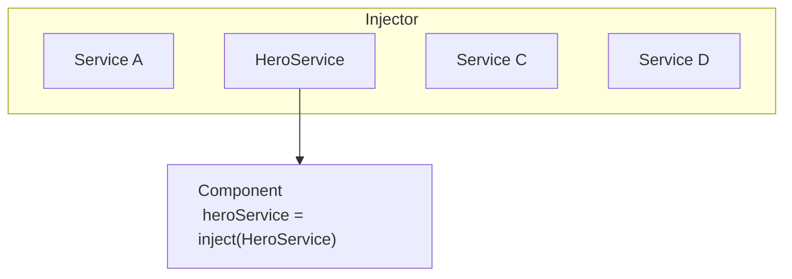

# [Dependency Injection in Angular](https://angular.dev/guide/di)
> "DI" is a design pattern and mechanism for creating and delivering some parts of an app the other parts of an app that require them.

when  you develop a smaller part of your system, like a module or a class, you may need to use features from other classes. For example, you may need an HTTP service to make backend calls. Dependency Injection or DI is a design pattern and mechainsm for creating and delivering some parts of an application to other parts of an application that require them. Angular supports this design pattern and you can use it in your applications to increase flexibility and modularity.

in Angular, dependencies are typically services but they also can be values such as strings or functions. an injector for an application (created automatically during bootstrap) instantiates dependencies when needed using a configured provider of the service or value.

## [understanding dependency injection](https://angular.dev/guide/di/dependency-injection)
dependency injection or DI is one of the cundamental concepts in Angular. DI is wired into the Angular framework and allows classes with Angular decorators such as Components, Directives, Pipes and Injectables to configure dependencies that they need.

two main roles exist in the DI system: dependency consumer and dependency provider.

Angular facilitates the interaction between dependency consumers and dependency providers using an abstraction called `Injector`. when a dependency is requested, the injector checks its registry to see if there is an instance already available there. if not a new instance is created and stored in the registry. Angular creates an application-wide injector (also known as the "root" injector) during the application bootstrap process. in most cases you don't need to manually create injectors, but you should know that there is a layer that connects providers and consumers.

this topic covers basic scenarios of how a class can act as a dependency. Angular also allows you to use functions, objects, primitive types such as string or Boolean or any other types as dependencies. for more information, see [Dependency providers](https://angular.dev/guide/di/dependency-injection-providers).


## [Providing a dependency]
consider a class called `HeroService` that needs to act as a dependency in a component.

the first step is to add the `@Injectable` decorator to show that the class can be injected.

```ts
@Injectable()

class HeroService {}
```

the next step is to make it available in the DI by providing it. a dependency can be provided in multiple places:
- [Preferred: at the application root level using `providedIn`](https://angular.dev/guide/di/dependency-injection#preferred-at-the-application-root-level-using-providedin)
- [At the Component level](https://angular.dev/guide/di/dependency-injection#at-the-component-level)
- [At the application root level using `ApplicationConfig`](https://angular.dev/guide/di/dependency-injection#at-the-application-root-level-using-applicationconfig)
- [`NgModule` based applications](https://angular.dev/guide/di/dependency-injection#ngmodule-based-applications)


### [Preferred: At the application root level using `providedIn`](https://angular.dev/guide/di/dependency-injection#preferred-at-the-application-root-level-using-providedin)
providing a service at the application root level using `providedIn` allow injecting the service into all other classes. Using `providedIn` enables Angular and JavaScript code optimizers to effectively remove servicees that are unused (known as tree-shaking).

you can provide a services by using `providedIn: 'root'` in the `@Injectable` decorator:
```ts
@Injectable({
    providedIn: 'root'
})
class HeroService {}
```

when you provide the service at the root level Anuglar creates a single, shared instance of th `HeroService` and injects it into any class that asks for it.


### at the Component level
you can provide services at `@Component` level by suing the `providers` field of the `@compoent` decorator. in this case the `HeroService` becomes available to all instances of this component and other components and directives used in the template.

for example:
```ts
@Component({
    selector: 'hero-list',
    template: '...',
    providers: [ HeroService ]
})
class HeroListComponent {}
```
when you register a provider at the component level, you get a new instance of the service with each new instance of that component.

> **NOTE**: Declaring a service like this causes `HeroService` to always be included in your application -- even if the service is unused.


### [at the application root level using `ApplicationConfig`](https://angular.dev/guide/di/dependency-injection#at-the-application-root-level-using-applicationconfig)
you can use the `providers` field of the `ApplicationConfig` (passed to the `bootstrapApplication` function) to provide a service or other `Injectable` at the application level.

in the example below, the `HeroService` is available to all components, directives and pipes:
```ts
export const appConfig: ApplicationConfig = {
    providers: [
        { provider: HeroService }
    ]
};
```

then, in `main.ts`:

```ts
bootstrapApplication(AppComponent, appConfig)
```

> NOTE: Declaring a service like this causes `HeroService` to always be included in your application -- even if the service is unused.


### `NgModule` based applications
`@NgModule` - based applications use the `providers` field of the `@NgModule` decorator to provide a service or other `Injectable` available at the application level.

a service provided in a module is available to all declarations of the module or to any other modules which share the same `ModuleInjector`. to understand all edge-cases, see [Hierachical injectors](https://angular.dev/guide/di/hierarchical-dependency-injection).

> NOTE: Declaring a service using `providers` causes the service to be included in your application -- even if the service is unused.

### Injecting/consuming a dependency
use Angular's `inject` function to retrieve dependencies.
```ts
import { Component, inject } from 'angular/core';

@Component({ /* ... */ })
export class UserProfile {
    // you can use the `inject` function in property initializers.
    private userClient = inject(UserClent);

    constructor() {
        //you can also use the `inject` function in a constructor.
        const logger = inject(Logger);
    }
}
```
you can use the `inject` function in any [injection context](https://angular.dev/guide/di/dependency-injection-context). 
most of the time, this is in a class property initializer or a class constructor for components, directives, serivces and pipes.

when Angular discovers that a component depends on a service, it first checks if the injector has any existing instances of that service. if a requested service instance doesn't yet exist, the injector creates one using the registered provider and adds it to the injector before returning the service to Angular.

when all requested services have been resolved and returned, Angular can call the component's contructor with those services as arguments.




## [Creating an injectable service](https://angular.dev/guide/di/creating-injectable-service)
Service is a broad category encompassing any value, function or feature that an application needs. a service is typically a class with a narrow, well-defined purpose. a component is noe type of class that can use DI.

Angular distinguishes components from services to increase modularity and reusability. by separating a component's view-related features from other kinds of processing you can make your component classes lean and efficient.

Ideally, a component's job is to enable the user experience and nothing more. A component should present properties and methods for data binding to mediate between the view (rendered by the template) and the application logic (which often includes some notion of a model).

a components can delegate certain tasks to services such as fetching data from the server validating ussser input or logging directly to the console. by defining such processing tasks in an injectable service class, you make those tasks available to any component. you can also make your application more adaptable by configuring defferent providers of the same kind of service as appropriate in different circumstances.

Angular does not enforce these principles. Angular helps you follow these principles by making it easy to factor your application logic into services and make those services available to components through DI.

### Service examples
here's an example of a service class that logs to the browser console:
```ts
export class Logger {
    log(msg: unknow) { console.log(msg); }
    error(msg: unknow) { console.error(msg); }
    warn(msg: unknow) { console.warn(msg); }
}
```

services can depend on other services. for example, here's a `HeroService` that depends on the `Logger` service, and also uses `BackendService` to get heroes. That service in turn might depend on the `HttpClient` service to fetch heros asynchronously from a server:
```ts
import { inject } from "@angular/core";

export class HeroService {
    private heroes: Hero[] = [];

    private backed = inject(BankendService);
    private logger = inject(Logger);

    async getHeroes(){
        // fetch
        this.heroes = await this.backend.getAll(Hero);
        // log
        this.logger.log(`Fetched ${this.heroes.length} heroes.`);

        return this.heroes;
    }
}
```


### Creating an injectable service
the Angular CLI provides a command to create a new service. in the following example, you add a new service to an existing application.

to generate a new `HeroService` class in th `src/app/heroes` folder, follow these steps:
1. run this [Angular CLI]() command:
```cmd
ng generate service heroes/hero
```

this command creates the following default `HeroService`:
```ts
import { Injectable } from '@angular/core';

@Injectable({
    providedIn: 'root'
})
export class HeroService {}
```

the `@Injectable()` decorator specifies that Angular can use this class in the DI system. The metadata, `providedIn: 'root'`, means that the `HeroService` is provided throughout the application.

Add a `getHeroes()` method that returns the heroes from `mock.heroes.ts` to get the hero mock data:

```ts
import { Injectable } from '@angular/core';
import { HEROES } from './mock-heroes';

@Injectable({
    // declares that this service should be created by the root application injector.
    providedIn: 'root'
})
export class HeroService {
    getHeroes() {
        return HEROES;
    }
}
```
for clarity and maintainability, it is recommended that you define components and services in separate files.


### Injecting services
to inject a service as a dependency into a component, you can declare a class field representing the dependency and use Angular's `inject` function to initialize it.

the following example specifies the `HeroService` in the `HeroListComponent`. the type of `heroService` is `HeroService`.
```ts
import { inject } from "@angular/core";

export class HeroListComponent {
    private heroService = inject(HeroService);
}

it is also possible to inject a service into a component using the component's constructor:
```ts
constructor(private heroService: HeroService)
```

the `inject` method can be used in both classes and functions, while the constructor method can naturally only be used in a class constructor. However, in either case a dependency may only be injected in a valid [injection context](https://angular.dev/guide/di/dependency-injection-context), usualy in the construction or initialization of a component.


### Injecting services in other services
when a service depends on another service, follow the same pattern as injecting into a component. in the following example, `HeroService` depends on a `Logger` service to report its activities:
```ts
import { inject, Injectable } from '@angular/core';
import { HEROES } from './mock-heroes';
import { Logger } from './logger.service';

@Injectable({
    providedIn: 'root'
})
export class HeroService {
    private logger = inject(Logger);

    getHeroes(){
        this.logger.log("Getting heroes.");
        return HEROES;
    }
}
```


## [Configuring dependency providers](https://angular.dev/guide/di/dependency-injection-providers)
the previous sections described how to use class instances as dependencies. Aside from classes, you can also use values such as `boolean`, `string`, `Date` and objects as dependencies. Angular provides the nessessary APIs to make the dependency configuration flexible, so you can make those values available in DI.

### Specifying a provider token
if you specify the service class as the provider token, the default behavior is for the injector to instantiate that class using th `new` operator.

in the following example, the app component provides a `Logger` instance:
```ts // app.component.ts
... 
providers: [ Logger ],
...
```
you can, however, configure DI to associate the `Logger` provider token with a different class or any other value. so when the `Logger` is injected, the configured value is used instead.

in fact, the class provider syntax is a shorthand expression that expands into a provider configuration, defined by the `Provider` interface. Angular expands the `providers` value in this case into a full provider object as follows:
```ts // app.conponents.ts
[{ provide: Logger, useClass: Logger }]
```
the expanded provider configuration is an object literal with two properties:
- the `provide` property holds the token that serves as the key for consuming the dependedcy value.
- the second property is a provider definition object, which tells the injector **how** to create the dependency value. the provider-definition can be one of the following:
    - `useClass` - this option tells Angular DI to instantiate a provided class when a dependency is injected.
    - `useExisting` - allows you to alias a token and reference any existing one.
    - `useFactory` - allow you to define a function that constructs a dependency.
    - `useValue` - provides a static value that should be used as a dependency.
the sections below describe how to use the different provider definitions.


### Class providers: useClass
the `useClass` provider key lets you create and return a new instance of the specified class.

you can use the type of provider to substitute an alternative implementation for a common or default calss.
the alternative implementation can for example, implement a different strategy extend the default class or emulate the behavior of the real class in a test case.

in the following example, `BetterLogger` would be instantiated when the `Logger` dependency is requested in a component or any other class:
```ts 
// /src/app/app.componet.ts
[{ provide: Logger, useClass: BatterLogger }]
```
if the alternative class providers have their own dependencies, specify both providers in the providers
metadata property of the parent module or component:
```ts
// src/app/app.component.ts
[
    UserService, // dependency needed in `EvenBetterLogger`.
    { provider: Logger, useClass: EvenBetterLogger }
]
```
in this example, `EvenBetterLogger` displays the user name in the log message. this logger gets the user from an injected `UserService` instance:
```ts
// src/app/even-better-logger.component.ts
@Injectable()
export class EvenBetterLogger extends Logger {
    private userService = inject(UserService);

    override log(message: string){
        const name = this.userService.user.name;
        super.log(`Message to ${name}: ${message}`);
    }
}
```
Angular DI knows how to construct the `UserService` dependency, since it has been configured above and is available in the injector.


### Alias providers: useExisting
the `useExisting` provider key lets you map one token to another. in effect, the first token is an alias for the service associated with the second token, createing tow ways to access the same service object.

in the following example, the injector injects the singleton instance of `NewLogger` when the component asks for either the new or the old logger: in this way, `OldLogger` is an alias for `NewLogger`.
```ts
/// src/app/app.component.ts
[
    NewLogger, // alias OlderLogger w/ reference to NewLogger
    { provide: OldLogger, useExisting: NewLogger }
]
```
> NOTE: ensure you do not alias `OldLogger` to `NewLogger` with `useClass`, as this creates two different `NewLogger` instances.


### Factory providers: useFactory
the `useFactory` provider key lets you create a dependency object by calling a factory function. With this approach, you can create a dynamic value based on information available in the DI and elsewhere in the app.

in the following example, only authorized user should see secret heroes in the `HeroService`.
Authorization can change during the course of a signle application session, as when a diferrent user logs in.

to keep security-sensitive information in `UserService` and out of `HeroService`, give the `HeroService` constructor a boolean flag to control display of secret heroes:
```ts
// src/app/heroes/hero.service.ts
class HeroService {
    constructor(private logger: Logger, private isAuthorized: boolean) {}
    
    getHeroes() {
        const auth = this.isAuthorized ? 'authorized' : 'unauthorized';
        this.logger.log(`Getting heroes for ${auth} user.`);
        return HEROES.filter(hero => this.isAuthorized || !hero.isSecret);
    }
}
```

to implement the `isAuthorized` flag, use a factory provider to create a new logger instance for `HeroService`. this is necessary as we need to manually pass `Logger` when constructing the hero service:
```ts
// src/app/heroes/hero.service.provider.ts
const heroServiceFactory = (logger: Logger, userService: UserService) => new HeroService(logger, userService.user.isAuthorized);
```

the factory function has access to `UserService`. you inject both `Logger` and `UserService` into the factory provider so the injector can pass them along to the factory function:
```ts
/// src/app/heroes/hero.service.provider.ts
export const heroServiceProvider = {
    provide: HeroService,
    userFactory: heroServiceFactory,
    deps: [Logger, UserService]
};
```

- the `useFactory` field specifies that the provider is a factory function whose implementation is `heroServiceFactory`.
- the `deps` property is an array of provider tokens, the `Logger` and `UserService` classes serve as tokens for their own class providers. the injector resolves these tokens and injects the corresponding services into the matching `heroServiceFactory` factory function parameters, bases on the order specified.

capturing the factory provider in the exported variable, `heroServiceProvider`, makes the factory provider reusable.


### Value providers: useValue
the `useValue` key lets you associate a static value with a DI token.

use this technique to provide runtime configuration constants such as website base addresses and feature flags. you can also use a value provider in a unit test to provide mock data in place of a production sata service.

the new section provides more information about the `useValue` key.


### using an `InjectionToken` object
use an `InjectionToken` object as provider token for non-class dependencies. the following example defines a token, `APP_CONFIG` of the type `InjectionToken`:
```ts
// src/app/app.config.ts
import { InjectionToken } from '@angular/core';

export interface AppConfig {
    title: string;
}

export const APP_CONFIG = new InjectionToken<AppConfig>('app.config description');
```
the optional type parameter, `<AppConfig>`, and the token description, `app.config description`, specify the token's purpose.

next, register the dependency provider in the componet using the `InjectionToken` object of `APP_CONFIG`:
```ts
// src/app/app.componsnt.ts
const MY_APP_CONFIG_VARIABLE: AppConfig ={
    title: 'Hello'
};

provider: [{ provide: APP_CONFIG, useValue: MY_APP_CONFIG_VARIABLE}]
```

new, inject the configuration object in the constructor body with the `inject` function:
```ts
// src/app/app.components.ts
export class AppComponent {
    constructor() {
        const config = inject(APP_CONFIG);
        this.title = config.title;
    }
}
```

### Interfaces and DI
though the TypeScript `AppConfig` interface supports typing within the class, the `AppConfig` interface plays no role in DI. in TypeScript, an interface is a design-time artifact, and does not have a runtime repersentation or token that the DI framework can use.

when the TypeScript transpiles to JavaScript, the interface desppears because JavaScript doesn't have interfaces. because there is no interface for Angular to find at runtime, the interface cannot be a token, nor can you inject it:
```ts
// src/app/app.component.ts
// can't use interface as  provider token
[{ provide: AppConfig, useValue: MY_APP_CONFIG_VARIABLE }]

...
export class AppComponent {
    // can't inject using the interface as the parameter type
    private config = inject(AppConfig);
}

```