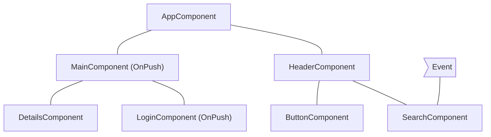
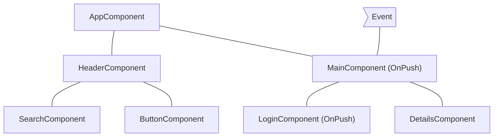
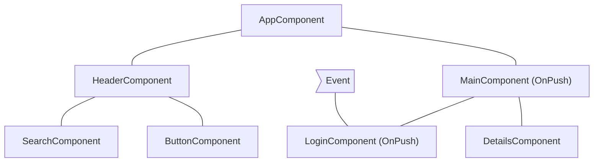
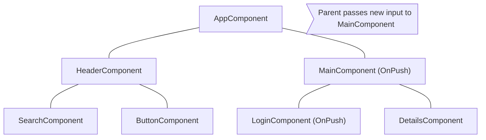

# [Performance](https://angular.dev/best-practices/runtime-performance)
runtime performance optimization


## [Zone pollution](https://angular.dev/best-practices/zone-pollution)


## [Show computations](https://angular.dev/best-practices/slow-computations)


## [Skipping component subtrees](https://angular.dev/best-practices/skipping-subtrees)


### using `OnPush`
OnPush change detection instructs Angular to run change detection for a component subtree **only** when:
- the root component of the subtree receives new inputs as the result of a template binding. Angular compares the current and past value of the input with `==`.
- Angular handles and event *(for example suing event binding, output binding or `@hostListener`)* in the subtree's root component or any of its children wheter they are using OnPush change detection or not.

you can set the change detection strategy of a component to `OnPush` in the `@Component` decorate:
```ts
import { ChangeDetectionStrategy, Component } from '@angular/core';

@Component({
    changeDetection: ChangeDetectionStrategy.OnPush
})
export class XComponent{}
```

### Common change detection scenarios
this section examines several common change detection scenarios to illustrate Angular's behavior.

### an event is handled by a component with default change detection
if Angular handles an event within a component without `OnPush` strategy, the framework executes change detection on the entrie component tree. Angular will skip descendant componet subtrees with roots using `OnPush`, which have not received new inputs.

as an example, if we set the change detection strategy of `MainComponent` to `OnPush` and the user interacts with a component outside the subtree with root `MainComponent`, Angular will check all the pink components from the diagram below (`AppComponent`, `HeaderComponent`, `SearchComponent`, `ButtonComponent`) unless `MainComponent` receives new inputs:



### An event is handled by a component with OnPush





### An event in handled by a descendant of a component with OnPush




### New inputs to component with OnPush



### Edge cases